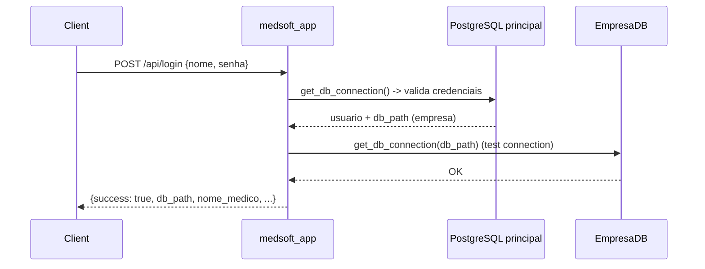
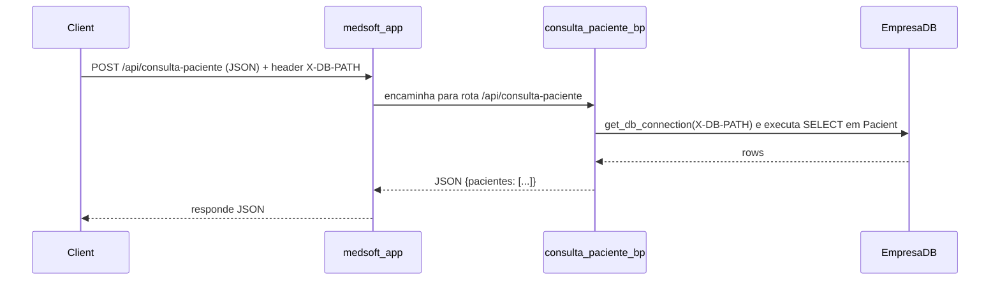
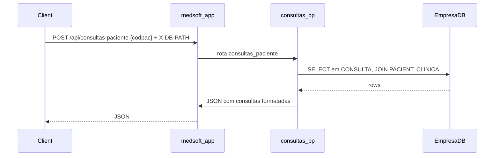
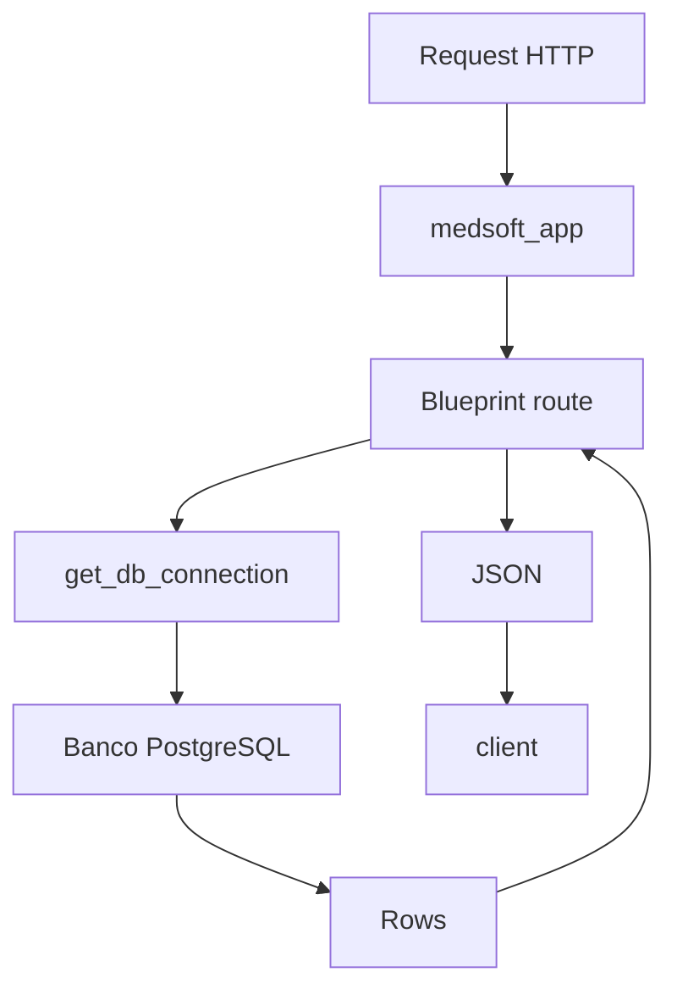

# Diagramas — resumo visual do backend

Este arquivo contém diagramas Mermaid que resumem a arquitetura, os fluxos principais (login, busca de pacientes e consultas) e o fluxo de dados.

**1) Arquitetura geral**

```mermaid
graph LR
  Client[Usuário (Frontend)] -->|HTTP| App[medsoft_app (Flask)]
  App -->|register_blueprint| ConsultaBP[consultas_bp]
  App -->|register_blueprint| PacienteBP[consulta_paciente_bp]
  App -->|register_blueprint| AgendaBP[agenda_bp / agenda_api_bp]
  ConsultaBP -->|usa|get_db_connection[medsoft_core.get_db_connection]
  PacienteBP -->|usa|get_db_connection
  AgendaBP -->|usa|get_db_connection
  get_db_connection -->|connect| PostgreSQL[PostgreSQL (Banco principal / Empresa)]
  App -->|serve| Templates[templates/ static/]
```

**Legenda:** o `App` registra Blueprints que executam queries via `medsoft_core.get_db_connection` para conectar ao PostgreSQL.

**2) Sequência: Login**



**3) Sequência: Consulta de paciente**



**4) Sequência: Histórico de consultas**



**5) Fluxo de dados (simplificado)**



**Observações rápidas**
- Os diagramas são ideais para documentação em Markdown/HTML (renderizadores que suportam Mermaid).
- Se preferir um `.docx` com imagens das figuras, posso renderizar cada diagrama como imagem e embutir em um `DOCUMENTATION.docx` para download.
