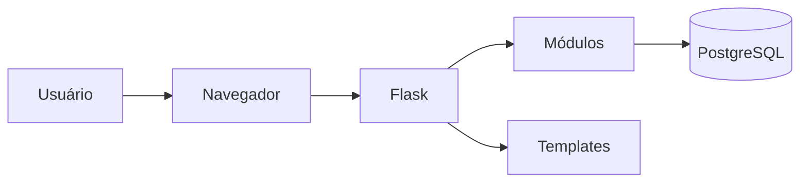

# Documentação Técnica do Medsoft

## Arquitetura

## Componentes centrais

- **medsoft_app.py**
- **config.py**
- **medsoft_core.py**
- **tenant_context.py**

## Fluxo básico

1. Inicialização da aplicação.
2. Carregamento das configurações.
3. Definição do contexto do tenant.
4. Registro de rotas e módulos.
5. Processamento das requisições.
6. Acesso ao banco de dados.
7. Renderização dos templates.

## Próximas etapas

- Documentar todos os módulos de API.
- Mapear rotas Flask.
- Relacionar templates HTML e JavaScript.
- Gerar dicionário do banco de dados.
